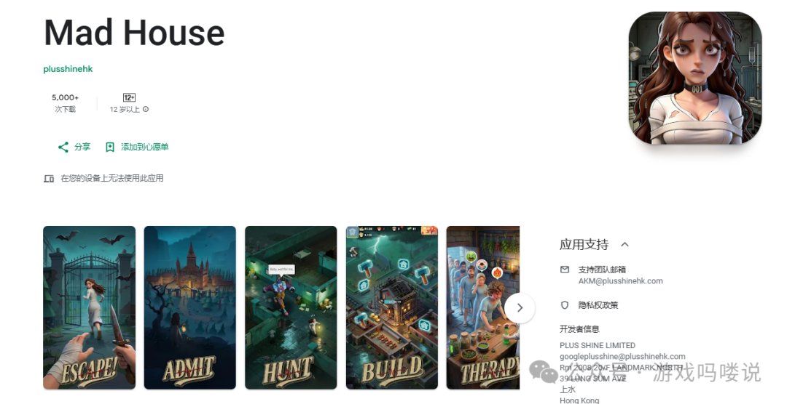
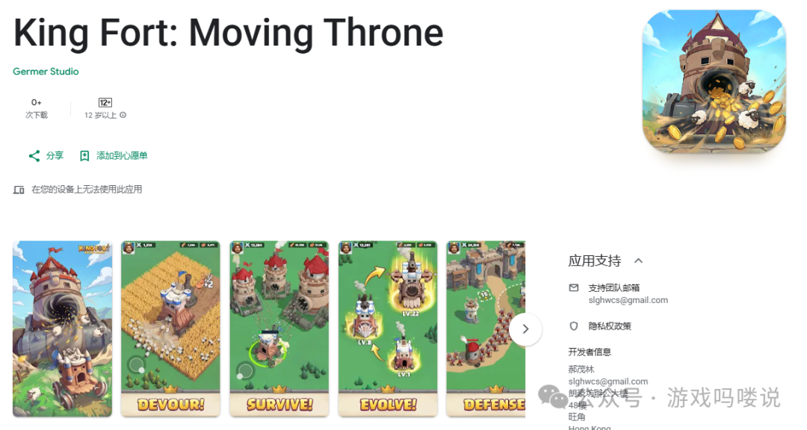
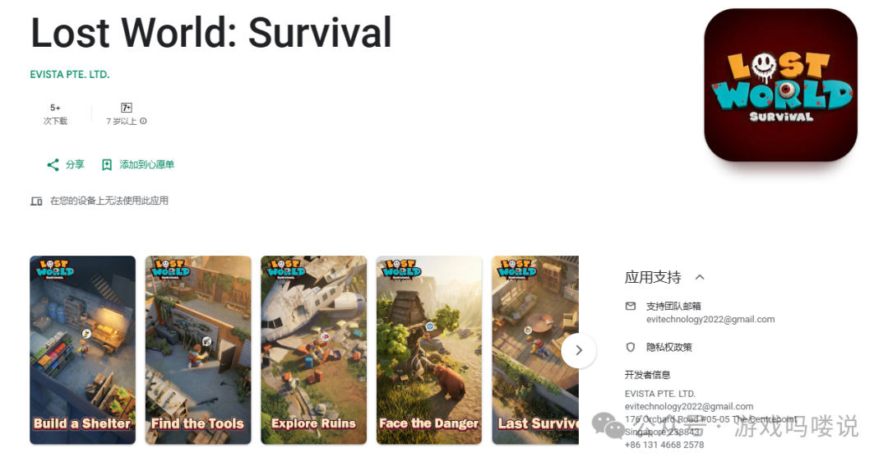
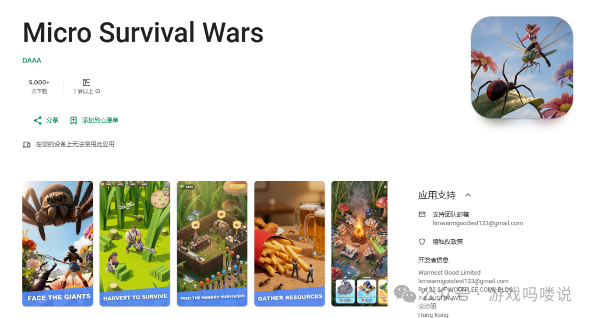
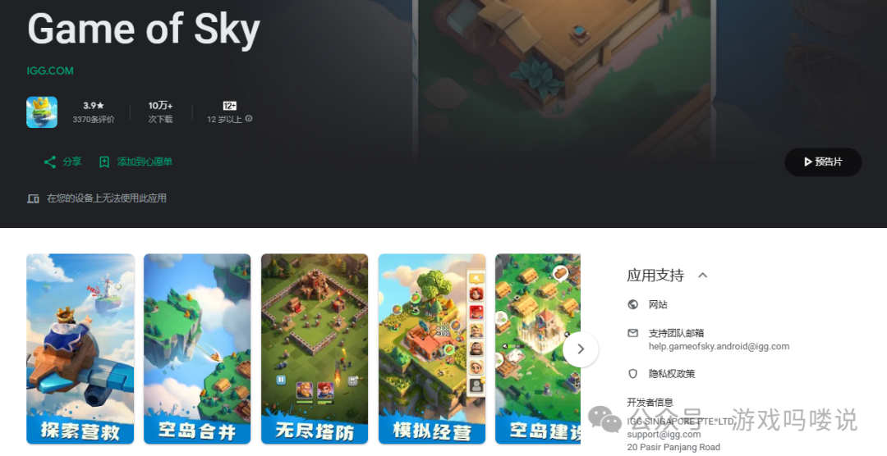
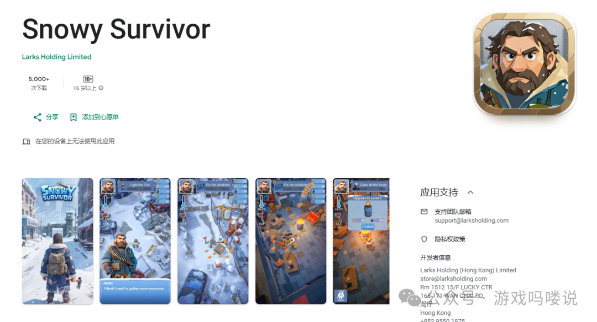

> 本地归档：从微信公众号跳转文章采集；用于补充 King Fort / 三七中世纪战车 SLG 案例。

# 20260416本周新游:三七居然做了款中世纪战车SLG？猛鬼宿舍和飞机割草会是爆款新玩法么？

原创不易~喜欢就点点关注~

Mad House

，时长

10:51

发行商：plusshinehk

差异点：微恐+猛鬼宿舍+卡通丧尸

锐评：前期玩法为猛鬼宿舍

副玩法为类似猛鬼宿舍的放置塔防游戏

前半小时到中期医院模拟经营过渡很丝滑

类似三七的Last Asylum: Plague

类似的玩法在Darkwar中也有进行过尝试

但整体的过渡MadHouse更优

放置塔防和模拟经营的设置对后面大地图建造有反哺效果

副玩法在发行上也是吸量差异点

但也会存在有副玩法长线深度不够的问题

在通关几次后容易产生疲劳

需关注关卡的设置

素材上目前AI视频

方向以世界观为主

目前游戏包体已经下架

游戏内容完整度已经很不错

整体仍为快速迭代前期副玩法过渡的产品

期待后续产品的优化调整

链接：https://play.google.com/store/apps/details?id=com.fungame.codemad

King Fort:Moving Throne

，时长

10:06

发行商：三七

差异点：Wanderburg+Thronefall

锐评：之前以Moving Throne的名字测试过

包装风格为中世纪卡通画风

前期通过类Wanderburg的中世纪战车割草

在保持玩法逻辑的基础上做了简化

配合模拟经营进行用户转化

整体的过渡思路很类似Kingshot

不过要注意战车和主城的数值关联

避免造成养成割裂

整体品质很不错

目前在T1，T3等国家少量测试

素材上为类KS的割草和图片素材

类似的玩法原型Tap4fun也有进行尝试

后续会保持关注

链接：https://play.google.com/store/apps/details?id=com.king.global

Lost World：Survival

，时长

13:36

发行商：途游EVISTA PTE. LTD.

差异点：树屋+搜打撤

锐评：避难所设计在树上

不过不同于智明星通Lost Day：Survival的处理思路

整体为带有Klondike迷雾探险元素的搜打撤

产品应该还在优化阶段

目前到5V5卡牌的过渡较为生硬

此前树屋等包装元素在素材侧较为吸量

但还是要看SLG主玩法的转化处理能力

素材方向目前为AI的世界观展示

可以保持关注

期待后续产品的优化调整

链接：https://play.google.com/store/apps/details?id=com.evista.survival&referrer=utm_source%3DTapTap

Micro Survival Wars

，时长

11:00

发行商：Funplus

差异点：微观+SLG

主要为微观题材上的体验创新

在海外测试多次

当时留存和付费应该没达到内部标准

相较之前的Bug Buddies等版本

舍弃掉了之前冗余的设计

参考了Tile Survival的前期逻辑

前期的过渡更为丝滑

整体体验感提升不少

目前素材方向以微观城建和AI方向为主

AI方向做的微观题材优势很大

虽微观类产品有部分受众和足够的差异化

不过同样会有低龄用户占比过高和代入感不足的风险

需要着重注意前期获客筛选和转化过渡

目前三七，点点，星合等均有微观类产品

期待后续的产品竞争

链接：https://play.google.com/store/apps/details?id=com.outbreakcounty.slg

Game of Sky

，时长

13:00

发行商：IGG

差异点：微观+飞机割草+天空岛

锐评：整体改动较大

画风由此前的类Fate War的魔幻卡通改为中世纪欧卡

整体的美术风格质量和游戏流畅度有明显提升

前30min为类KS框架

副玩法为类似低空版Thronefall的飞机割草

很有创意的结合

但目前类似的题材未出过大爆款产品

期待后续的产品的调整

链接：https://play.google.com/store/apps/details?id=com.igg.android.gameofsky

Snowy Survivor

，时长

11:11

发行商：Tap4fun

差异点：冰雪+搜打撤

锐评：去年8月的时候测过

前期的剧情进行了优化

同时游戏整体内容也进行了补充

冰雪题材天生带有资源匮乏和生存的压力

其本身和都市收集生存很搭配

生存氛围营造的很足

但前期搜集的节奏有些拖沓

到卡牌对战的时间有些久

目前在T1等地区少量投放测试

发行素材目前为录屏的切片

个人还是很期待的

链接：https://play.google.com/store/apps/details?id=com.larks.x11.gplay

原创不易～喜欢就点点关注～下次不迷路

往期回顾：

20260318本周新游:Funplus，海彼等多款新作爆发？飞机肉鸽和高空射击会是爆款新思路么？

20260226本周新游:江娱,Tap4fun，IGG等年初新品爆发？土拨鼠和卡皮巴拉会是爆款新角色么？

20260107本周新游:星合居然也做了款兵人SLG？瘟疫医生和模拟经营会是融合新思路么？

20251230本周新游:点点互动，三七，途游新作集中爆发？毒气+割草SLG能碰撞出什么？

20251223本周新游:Funplus的范围割草融合SLG？爽感模拟经营玩法会是爆款新思路么？

20251218本周新游:龙创也做了款自己的LastZ？搜打撤和骰子肉鸽等会是爆款新玩法么？

20251210本周新游:三七居然也有自己的Darkwar？黑白漫画和太空异星会是爆款新思路么？

20251203本周新游:点点的卡通丧尸和Kingshot的结合有戏么？割草和高空射击哪个副玩法会是下一个爆款？

20251127本周新游:江娱的收集塔防副玩法结合SLG有戏么？Kingshot和帕鲁的缝合会是下一个爆款么？

20251119本周新游:星合居然出了个兽耳娘SLG？机甲，帕鲁，饥荒哪个会是爆款新方向？

20251114本周新游:江娱居然出了个冰雪模拟经营SLG？绝命毒师等题材会是SLG爆款的新方向么？

20250812本周新游:IGG的神话SLG会是下一个超级爆款么？冰雪末日都市题材会是新思路么？

20250805本周新游:三七也做了款黑洞玩法？模拟经营和SLG的结合会是新思路么？

20250709本周新游:Thronefall+SLG还能再造一个爆款么？掌趣,IGG悄悄猛测多款新品？

20250703本周新游:Funplus的倒杯子融合SLG？猛鬼宿舍玩法会是爆款新思路么？

20250612本周新游:三七也做了款Last Z？丧尸SLG还有玩法融合新思路？

