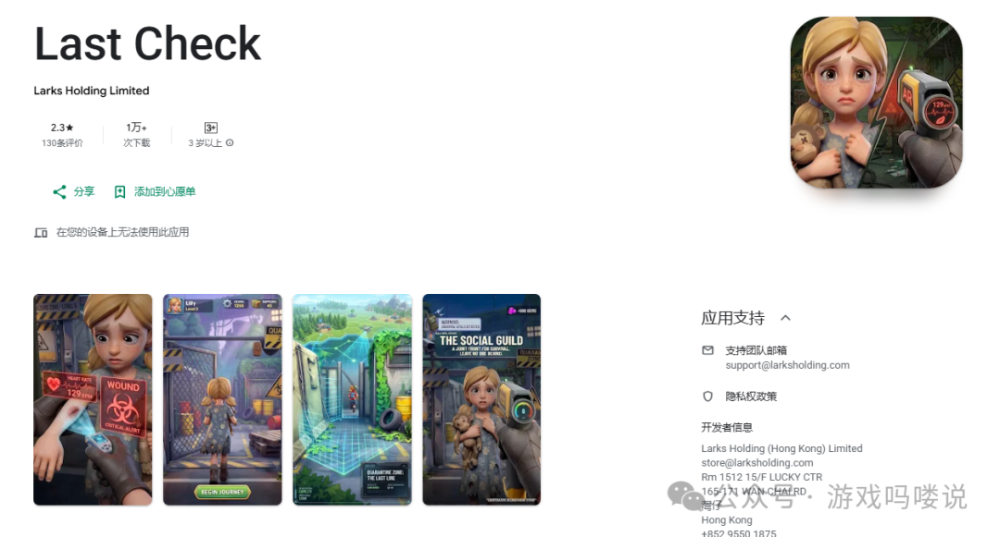
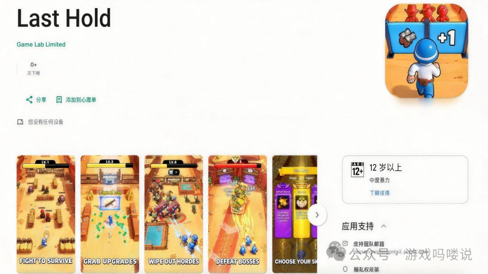
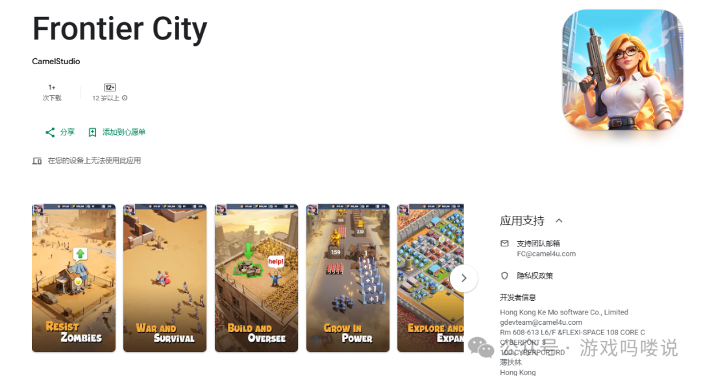
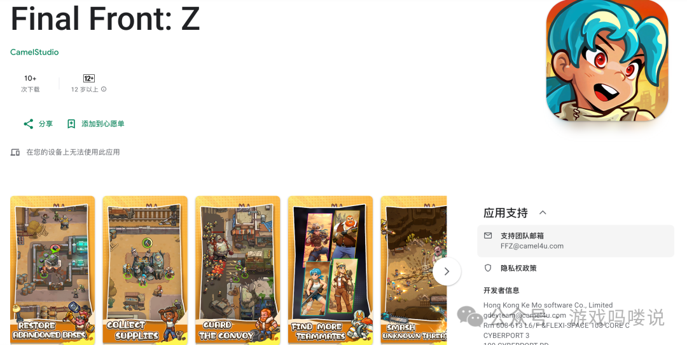
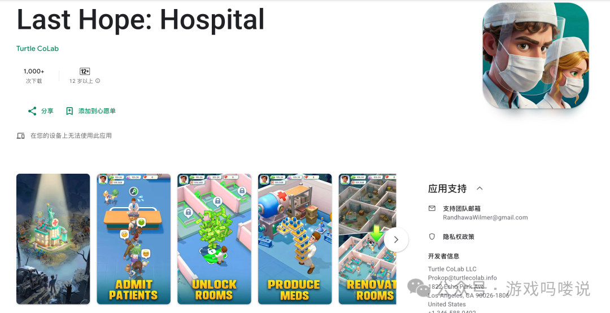
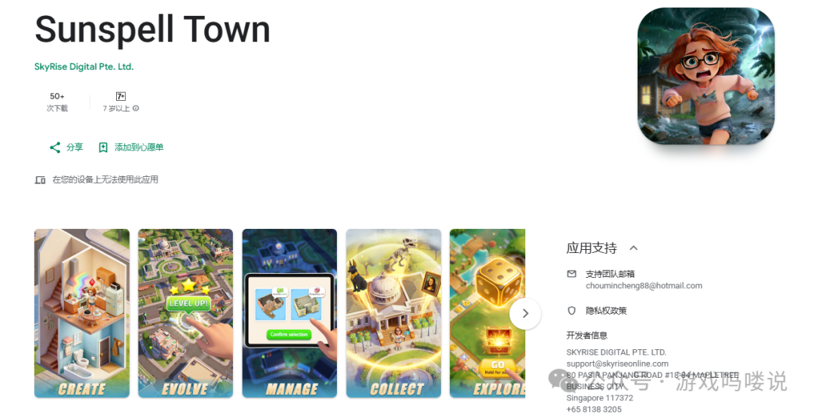

> 本地归档：由 `fetch_wechat_via_browser.py` 从微信公众号页面采集并转换为 Markdown；图片已落地到同级资产目录。

# 20260430本周新游:Tap4fun，壳木等多款新品集中爆发？检疫玩法和家居装修会是SLG爆款新思路么？

原创不易~喜欢就点点关注~

Last Check

，时长

13:56

发行商：Tap4fun

差异点：检疫+SLG

锐评：之前以Quarantine Zone名字测试过

玩法上类似一年前的Steam火爆独游《检疫区：最后一站》

其本身是个很不错的SLG玩法原型

把检疫工作作为低成本理解钩子

后续重点转为营地的模拟经营建设

后期当丧尸进攻时有无人机射击战斗元素

Tap4fun沿用了类似的思路

并通过模拟经营搜集玩法逐渐过渡

整体美术质量和品质是在线的

素材方向为录屏向

Tap4fun最近的思路都是通过Steam独游来确定前期的副玩法

后续通过SLG数值成长线的设计来变现

期待后续产品的优化

链接：https://play.google.com/store/apps/details?id=com.larks.x6.gplay

Last Hold

，时长

05:34

发行商：江娱系

差异点：范围肉鸽

锐评：游戏目前比较初期

玩法类似弓箭传说的范围割草

通过走位攻击范围内的小怪获得三选一强化

结合了Rougelike和RPG养成元素

整体不像之前江娱系的风格

更像Habby的测试思路

通过小玩法和纯minigame来进行前期测试

底层设计和变现思路也偏休闲/中度游戏

在关卡的节奏点和前期爽点上设置不够连贯

容易导致玩家心流断掉

目前在T1国家少量测试

可以保持关注

链接：https://play.google.com/store/apps/details?id=com.fun.c.lastline.gp

Frontier City

，时长

16:20

发行商：壳木

差异点：高空射击+数值门+合成元素

锐评：此前测试过多次

前期的玩法和整体过渡均进行了改变

副玩法为偏战斗向的高射和数值门打桶

后续通过合成建设过渡到城市建设和大地图玩法

合成城建的设置较丝滑和爽快

即战斗副玩法+合成城建+SLG核心玩法

鉴于目前LW和LZ等投放力度有所下滑

控制好投放成本和后续商业化节奏转化

还是有一定的竞争力

素材侧上目前为打桶过门和战斗建造类素材

在T1和T3少量投放测试

期待后续产品的优化调整

链接：https://play.google.com/store/apps/details?id=com.camelgames.xcity

Final Front：Z

，时长

04:35

发行商：壳木

差异点：割草+模拟经营+SLG

人物角色沿用了此前Stellar Sanctuary的角色设计

相较上次测试

将此前美漫风太空题材替换为了废土世界题材

整体还是借鉴了类《环世界》的俯视角模拟生存建造这个养成模式

通过割草玩法过渡到避难所的建造养成

进而到TD塔防和沙盘大地图

相较于其他竞品

有一定差异化

不过核心还是要关注“重+重+重”的设计下玩法的重心平衡问题

后续继续观察此类产品的优化

链接：https://play.google.com/store/apps/details?id=com.game.finalfront

Last Hope：Hospital

，时长

13:03

发行商：Turtle CoLab

差异点：医院模拟经营+SLG

锐评：在游戏一开始会有个用户调研

玩法原型为《My Pefect Hotel》

整体的思路类似现代版本的《Last Asylum：Plague》

模拟经营+放置卡牌+Coklike的三段式Slg结构

初期同样通过治疗区域扩张来让玩家逐步感受城镇扩张的过程

同时也设置了多个卡点来进行用户筛选

不过对比《Last Asylum：Plague》的黑死病题材

本作的压力点不够突出

后续可能需要在压力钩的设置上进行优化

不过整体为很有创意的结合

有一定差异化

期待后续的产品间竞争

链接：https://play.google.com/store/apps/details?id=com.projecth.gp

Sunspell Town

，时长

15:54

发行商：IGG

差异点：房屋装修+女性向+SLG

锐评：IGG很新奇的一种尝试

预测为女性向用户会多些

前期为房屋装修的模拟经营

类似的玩法其实是和类Gossip Harbor的二合类游戏结合较常见

因为其二者本质是相同的

均是把大目标拆分为无数的小目标

再把无数小目标拆城无数的小反馈来使玩家不断获得正反馈

另外不同于类Gossip Harbor的强剧情驱动

本作通过中期通过大富翁转盘等和卡牌战斗进行过渡

进而过度到城市建设和大地图

素材侧为装修类素材

目前同类型产品还是很少见的

算是很大胆的尝试

期待后续产品的调整

链接：https://play.google.com/store/apps/details?id=com.sunspelltown.android

原创不易～喜欢就点点关注～下次不迷路

往期回顾：

20260416本周新游:三七居然做了款中世纪战车SLG？猛鬼宿舍和飞机割草会是爆款新玩法么？

20260318本周新游:Funplus，海彼等多款新作爆发？飞机肉鸽和高空射击会是爆款新思路么？

20260226本周新游:江娱,Tap4fun，IGG等年初新品爆发？土拨鼠和卡皮巴拉会是爆款新角色么？

20260107本周新游:星合居然也做了款兵人SLG？瘟疫医生和模拟经营会是融合新思路么？

20251230本周新游:点点互动，三七，途游新作集中爆发？毒气+割草SLG能碰撞出什么？

20251223本周新游:Funplus的范围割草融合SLG？爽感模拟经营玩法会是爆款新思路么？

20251218本周新游:龙创也做了款自己的LastZ？搜打撤和骰子肉鸽等会是爆款新玩法么？

20251210本周新游:三七居然也有自己的Darkwar？黑白漫画和太空异星会是爆款新思路么？

20251203本周新游:点点的卡通丧尸和Kingshot的结合有戏么？割草和高空射击哪个副玩法会是下一个爆款？

20251127本周新游:江娱的收集塔防副玩法结合SLG有戏么？Kingshot和帕鲁的缝合会是下一个爆款么？

20251119本周新游:星合居然出了个兽耳娘SLG？机甲，帕鲁，饥荒哪个会是爆款新方向？

20251114本周新游:江娱居然出了个冰雪模拟经营SLG？绝命毒师等题材会是SLG爆款的新方向么？

20250812本周新游:IGG的神话SLG会是下一个超级爆款么？冰雪末日都市题材会是新思路么？

20250805本周新游:三七也做了款黑洞玩法？模拟经营和SLG的结合会是新思路么？

20250709本周新游:Thronefall+SLG还能再造一个爆款么？掌趣,IGG悄悄猛测多款新品？

20250703本周新游:Funplus的倒杯子融合SLG？猛鬼宿舍玩法会是爆款新思路么？

20250612本周新游:三七也做了款Last Z？丧尸SLG还有玩法融合新思路？
